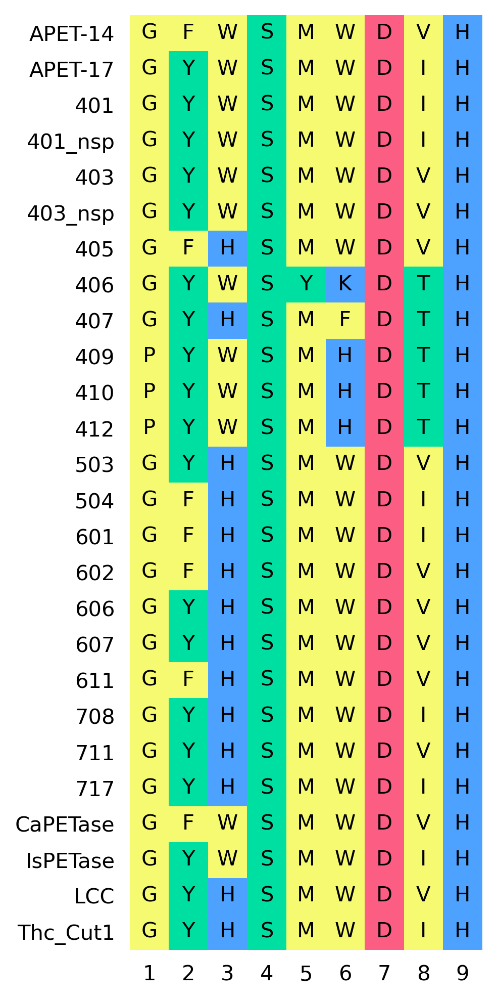
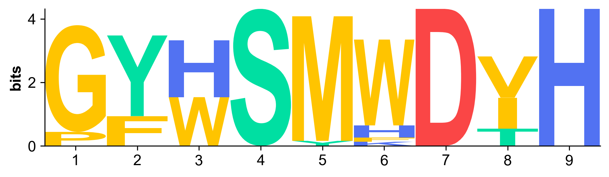

# Multiple Sequence Alignment

## Overview

Using `astraea.sequence` to deal with protein sequence and multiple sequence alignments (MSA)

## Load MSA

To load MSA as a `.fasta` file

```python
import astraea.sequence

# load the alignment
align = astraea.sequence.ProteinAlignment()
align.load_fasta("example.fasta")
```

## MSA Visualization

In `astraea.sequence.figure`, we support quick visualization using `plot_msa` function

```python
import astraea.sequence.figure

# plot msa
fig, ax = plt.subplots(figsize=(3,8))
astraea.sequence.figure.plot_msa(align, ax)
fig.savefig("example.png", dpi=300, bbox_inches='tight')
plt.show(ax)
```

Or easily:

```python
from astraea.sequence.figure import plot_msa

# plot msa
plot_msa(align)
```

Example output figure:




## Logo Plot

You can use the `plot_logo` function in `astraea.sequence.logoplot` to create a logo plot using an `ProteinAlignment` object:

```python
import astraea.sequence.logoplot

# create logo plot
fig, ax = plt.subplots(figsize=(8, 2))
astraea.sequence.logoplot.plot_logo(align, ax)

plt.savefig("logoplot.png", bbox_inches="tight", dpi=300)
plt.show()
```

Example output figure:




